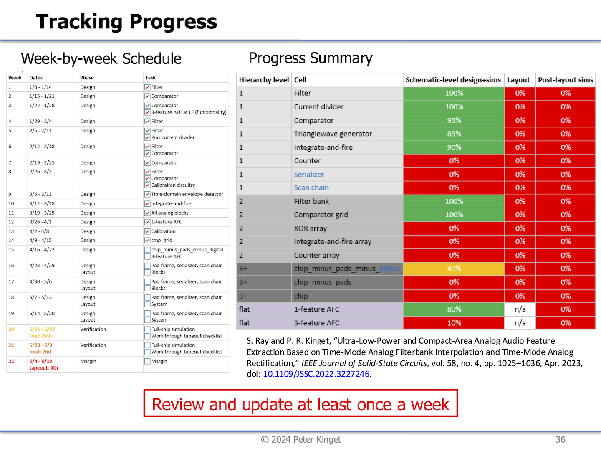

# General comments for the MOSbius Track Slides (week 9)

Peter Kinget  
August 7, 2025

## Add an Overview Slide
- Please start with an **overview slide** for your project:
    - Team name, members
    - Link to Github repo
    - Brief 'abstract' of what you are aiming to build
        - Example: "\<Chip name\> is a MOSbius-style chip to demonstrate power electronic circuits and includes 
    - Block Diagram
    - Dimensions: (your current best estimate, e.g., 300um x 700um)
    - Number of pins: (your current best estimate, e.g., 20 pins: VDD, VSS, 9 analog, 9 digital)

## Add a Status Progress Slide
- Take a look at this template and make a status slide for you project

<!--  -->

## Finish with Open Issues Slide
- Finish your presentation with a list of open issues where you need help, questions, calls for collaboration, ... 

## Add Ample Text Comments
- These slides serve as documentation and will be read *mostly without an oral presentation;* add sufficient text comments to the slides as to what e.g., the conclusions are of a simulation: meets requirements, illustrates a problem, raises a question, ... 

- Each slide needs to have a *subtitle* and text; do not simply paste schematics or simulation plots on a slide without explanation

- It's OK if the slides are dense

- **Make sure you put a pdf of the slides in your repo**

## Presentation Order
- Start from the top level and then go into blocks, so the *context of a block* is understood: what is driving it, what is loading it, where do control signals come from, ... 

## Tips for Presenting Circuits

- Again, always simulate your circuits with the correct signal source driving it and with the correct loading. 
    - E.g. when applying a clock, do not connect the ideal voltage source to your circuit but put two inverters as a buffer to get realistic clock waveforms
    - If you do not have the next stage ready to attach as a load, estimate the load and put a resistive // capacitive load. A 'bad' estimate is still better than 'no' estimate!
    - Take a look at [F.A. Design Q.](../design_FAQ/)

- **Ban** ideal voltage sources and ideal current sources:
    - put a parallel resistance to bias current sources; think what an appropriate value is, that is very instructive: 10K, or 100K, or more, or less ... There is no single universal answer
    - put a series resistor for a voltage source
        - power supply, say 10 Ohms or less (This will start to model real sources and/or supply wiring resistance leading to IR drops)
        - signal source: 
            - a lot of lab equipment has a 50Ohm output impedance
            - if it is a another circuit, try to include it or think about what an appropriate model is

> NOTE: Ideal circuit elements can actually create 'artificial' issues in circuits that can take a lot of time to debug but are not physical. 

- When using standard cells, specify which ones:
    - GF 5V or OSU 3.3V
    - 7t or 9t

- When showing an amplifier:
    - Put numbers next to the schematic (in the schematic!) with target specs:
        - Basic: Power, VDD, DC Gain, Unity-Gain BW, $C_{L}$, $R_{L}$, (gm/I) of devices, ...
        - Other: Phase margin, offset, slew rate, ...

- For stability studies:
    - Make sure to show the simulated *loop gain* frequency response (`.ac`) with the correct feedback factor
    - Document what *loading* you are using
    - Add transient step responses with small and *large* step inputs using (`.tran`)

- When showing a comparator:
    - What type of comparator: 
        - clocked or 'continuous-time' 
        - w/ or w/o hysteresis
    - Speed target

- When showing a (ring) oscillator
    - Make sure to include a reasonable (on-chip or off-chip) load
    - Think about how sensitive you are to layout parasitics and over design in anticipation
    - Start layout and PEX verification on (high speed) blocks like ring oscillators, dividers, non-overlap clock generators, ... 
    - Show a tuning curve (ideally across PVT)

- Zoom in to waveforms
- Put markers on relevant points
- Summarize results in **tables**
- **Remove grids** from your schematics when pasting

## Good Practice Comments
- Remove all spice commands from your block schematics, only have them in test benches

